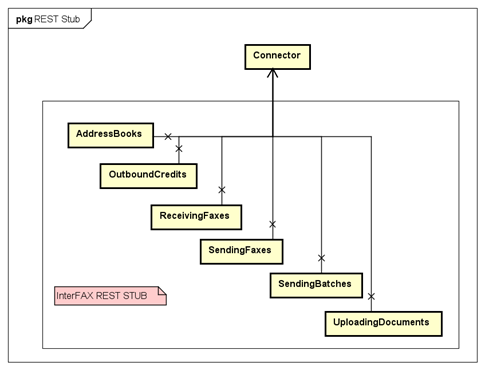
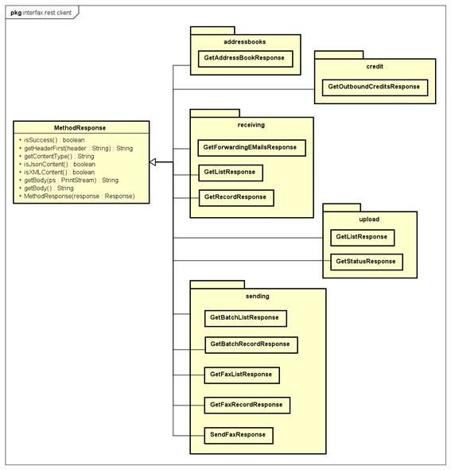

<html>
    <body>
        <h1>■ InterFAX REST サービス アクセスサンプル</h1>

        このプロジェクトコードでは、InterFAX REST サービスへアクセスする為の Java サンプルプログラムを公開しています。
        ご利用になられる場合は適宜自由に改修して頂いて構いませんが、ご利用者様の業務システムとあわせて業務上必要な要件に対する充分な動作検証を実施してください。

        

            <h3>1. 前提とする環境</h3>
            当該サンプルプログラムは、Java8の環境を基準に動作を確認しています。

            <h3>2. アーキテクチャ</h3>
            <h4>2-1. InterFAX RESTサービスの呼出</h4>
            RESTサービスの呼出は、以下の5つのSTUB(クラス)に分類して実装されています。 
            各STUBは、接続先情報を提供するConnectorクラスを使ってインスタンス化します。 
            その後、アプリケーションは、各STUBで提供されるそれぞれのREST APIの呼出を行います。 
            
            <h4>2-2. 戻り値</h4>
            REST API の戻り値は、MethodResponseクラスが基本となりますが、必要に応じてAPI毎に継承を行っています。
            例えば、過去のFAX送信リクエストの一覧を取得するような場合がそのケースです。 
             
            いずれにしろREST API呼出の成否は、MethodResponse.isSuccess()によって確認を行います。 
            尚、通信エラーなどの場合は、javax.ws.rs.ProcessingExceptionがスローされます。 
            

            <h3>3. REST APIの分類と呼出サンプル</h3>
            REST APIの分類は、そのままSTUBとして分類されています。mainパッケージ内に、多数のサンプル呼出コードを提供しています。
            これらを参考として頂ければ、呼出手順や結果の取得方法などがご理解頂けるかと存じます。
            <h4>3-1. Addressbooks</h4>
            「アカウント管理WEB」(https://secure.interfax.net) にてご利用者様が設定されている、リスト(Address Book)を取得できます。 
             
            【mainパッケージ内のサンプルの呼出コード】
            <table>
                <tr>
                    <td>ExecGetAddressBooks</td>
                    <td>[アカウント管理WEB]にて登録済みの [リスト](AddressBooks)の一覧を取得</td>
                </tr>
            </table>
        

    </body>
</html>
